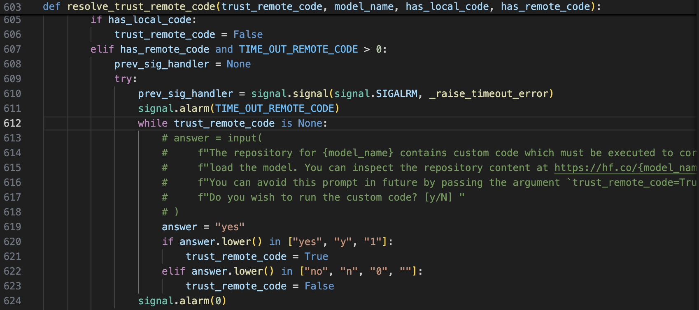

# 수동 Tagger
## demo
<br>

## 실행
- python3 설치
- ``git clone https://github.com/pupba/tagger.git``
### Linux & mac
- ``chmod +x run.sh``
- ``./run.sh``
- Args
    ```
    Usage: ./run.sh -i inputs -o outputs [options]...

    -h                   show this help
    -i input-path        이미지 파일 디렉토리 경로 (기본값: ./inputs)
    -o output-path       저장 디렉토리 경로 (기본값: ./outputs)
    -d default-path      기본 태그 파일 디렉토리 경로 (기본값: ./default.xlsx)
    -sn server-name      Gradio 서버 호스트 이름 (기본값: 127.0.0.1)
    -sp server-port      Gradio 서버 포트 (기본값: 7861)
    -s                   Gradio 서버 공유 모드 활성화 (기본값: False)
    ```
### other
- ``pip install requirements.txt``
- ``python runner.py``
- Args
    ```
    Usage: runner.py -i inputs -o outputs [options]...

    -h                   show this help
    -i input-path        이미지 파일 디렉토리 경로 (기본값: ./inputs)
    -o output-path       저장 디렉토리 경로 (기본값: ./outputs)
    -d default-path      기본 태그 파일 디렉토리 경로 (기본값: ./default.xlsx)
    -sn server-name      Gradio 서버 호스트 이름 (기본값: 127.0.0.1)
    -sp server-port      Gradio 서버 포트 (기본값: 7861)
    -s                   Gradio 서버 공유 모드 활성화 (기본값: False)
    ```
### ✅ v0.0.3 Update
- 그림체 선택 추가
- 데포르메 유무 선택 추가
- 기존 style에 있던 내용을 color로 수정
- 카메라 샷, 카메라 무브, 캐릭터 관련 태그 여러개 선택 가능
- 태그별 분류기 기능 추가

### ✅ v0.0.2 Update
- 실행전에 라이브러리 수정
- `venv/lib/python3.11/site-packages/transformers/dynamic_module_utils.py`
- 여기서 다음과 같이 수정(`input` 부분 주석 후 `answer = "yes"`)

<br> 